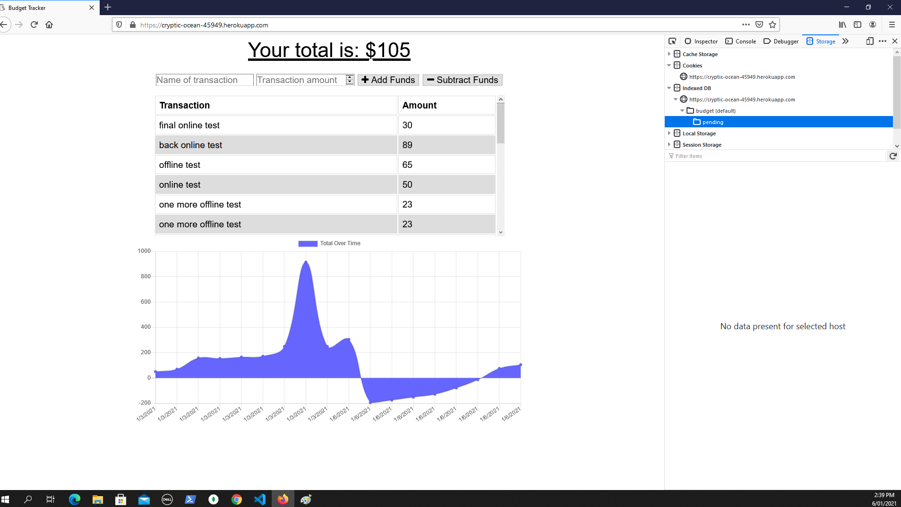
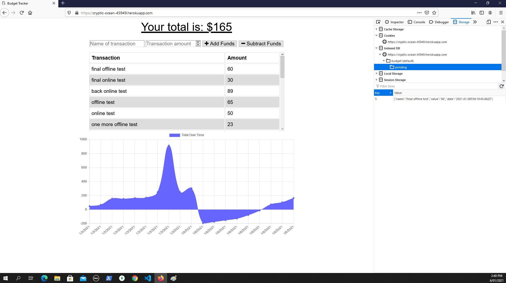
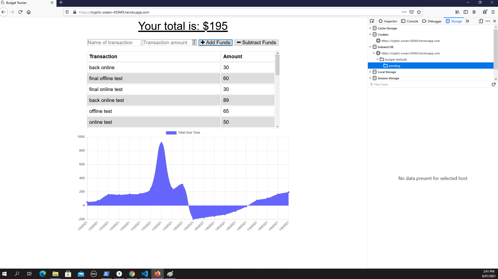

# Unit 18 PWA Homework: Online/Offline Budget Trackers

This app adds functionality to our existing Budget Tracker application to allow for use offline.

The user can add expenses and deposits to their budget with or without a connection. When entering transactions offline, they should populate the total when brought back online.

It has the following offline Functionality:

  * deposits and expenses offline can be entered.

When brought back online:

  * Offline entries can be added to tracker and be saved to the database online - so when the page is refreshed, they will still be there. 

To accomplish this, this app uses a service worker and the indexed.db in the browser. The service worker caches the pages for viewing when there is no internet connection (Note: only firefox unreservedly serves cached pages when there is no internet connection after Chrome ceased having the view cached pages button). The data gets saved to the indexed.db part of the browser and goes into a table there called pending. When the site comes back online, db.js serves them back to the database. 

When the app is online, the data gets put right in the the database.

when the app is offline, the data cannot be saved to the database, so it gets saved in the indexeddb of the browser. 

when the app goes back online, the data disappears from the indexdb and it is saved to the database. 

